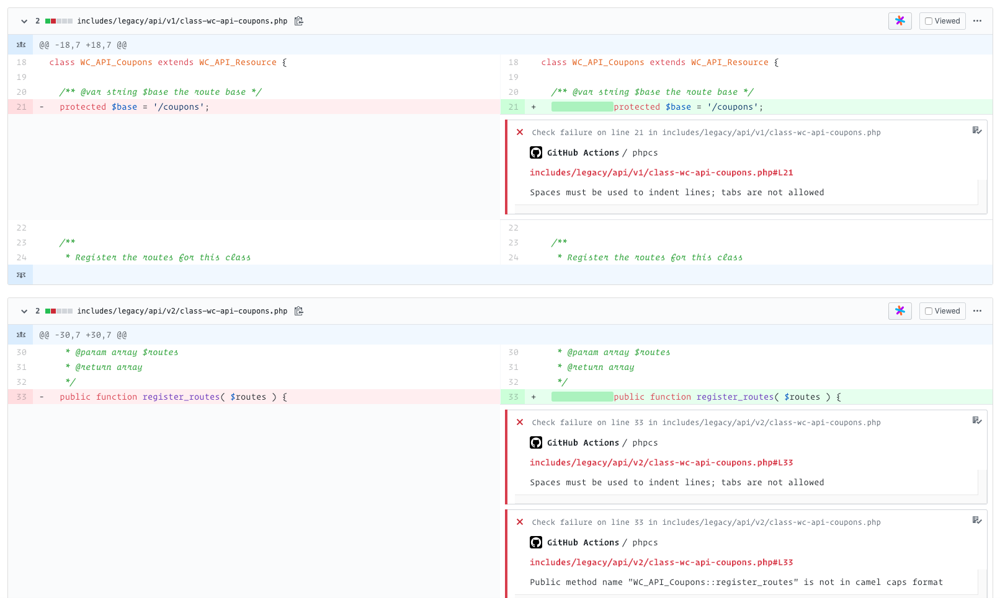

# GitHub Action to run PHP_CodeSniffer of files changed in current PR or even on changed lines

This action runs [PHP_CodeSniffer](https://github.com/squizlabs/PHP_CodeSniffer) on files changed in a Pull Request, by default annotating only lines changed by the PR author. So, it's fast and great to work with legacy code:



Contrary to some existing solutions this actions works faster than Docker based actions (as it runs from Node.JS directly in the same VM) and runs only on changed files (good 
for big projects with some non-conform files as well as to gradually introduce code style).

## Usage

Add a file like this to `.github/workflows/phpcs.yml`:

```yml
name: "CI"

on:
  pull_request:
    paths:
      - "**.php"
      - "phpcs.xml"
      - ".github/workflows/phpcs.yml"

jobs:
  phpcs:
    runs-on: ubuntu-latest
    steps:
      - uses: actions/checkout@v2
        with:
          fetch-depth: 0 # important!

      # we may use whatever way to install phpcs, just specify the path on the next step
      # however, curl seems to be the fastest
      - name: Install PHP_CodeSniffer
        run: |
          curl -OL https://squizlabs.github.io/PHP_CodeSniffer/phpcs.phar
          php phpcs.phar --version

      - uses: tinovyatkin/action-php-codesniffer@v1
        with:
          files: "**.php" # you may customize glob as needed
          phpcs_path: php phpcs.phar
          standard: phpcs.xml
```

You also will need either to pick a build code style standard or create `phpcs.xml` file (like [this](https://github.com/woocommerce/woocommerce/blob/master/phpcs.xml) for example).
You may find all available configuration options at [action.yml](action.yml) in this repository.
Example of this action running over small change in big legacy codebase: https://github.com/tinovyatkin/woocommerce/pull/1/checks?check_run_id=642017335
